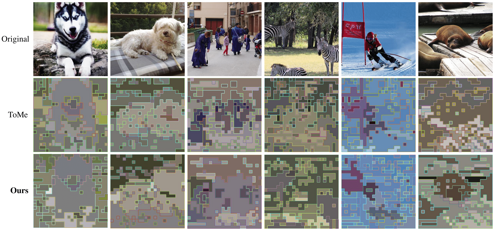
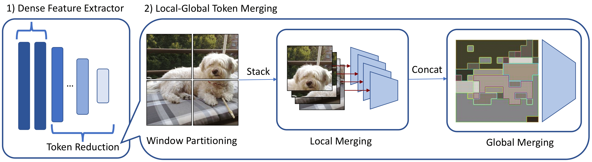
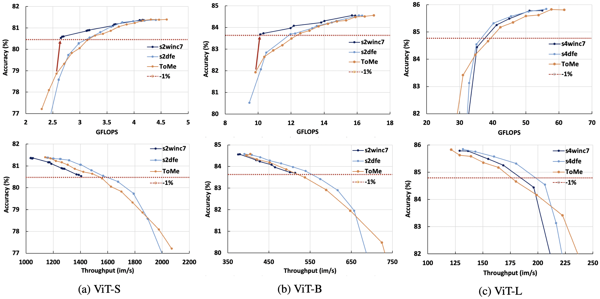
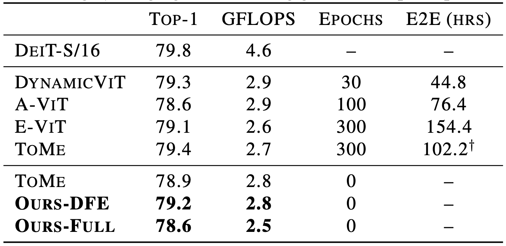

# A Fast Training-free Compression Framework for Vision Transformers
Official Pytorch Implementation of our paper "A Fast Training-free Compression Framework for Vision Transformers" [[paper](https://arxiv.org/pdf/2303.02331.pdf)]


> Jung Hwan Heo, Arash Fayyazi, Mahdi Nazemi, Massoud Pedram

## Motivation

[Token Merging (ToMe)](https://github.com/facebookresearch/ToMe)  emerged as a promising solution to accelerate off-the-shelf Vision Trnansformers _without training_. However, it can suffer from accuracy drop when compared to other token reduction techniques that do use training. In this work, we propose a more performant training-free paradigm to close the performance gap.

## What is it?

We propose three techniques:
- Dense Feature Extractor (DFE) that initially extracts high quality features
- Training with sharpness-minimization optimizers 
- Local-Global Token Merger (LGTM) that exploits spatial relationships at different contexts

## The Inference Pipeline
1. (Optional) Use a ViT with a flat local minima (e.g. [SAM](https://github.com/davda54/sam))
2. Keep the first few layers dense 
3. Begin local merging
    - partition the $H \times W$ tokens into four equally-sized $w \times w$ windows.
    - locally merge $\lceil r/ 4 \rceil$ tokens 
4. Begin global merging
    - merge $r$ tokens 

## Installation
Coming soon!

## Usage
Coming soon!

## Results
Here are some expected results when using the timm implementation *off-the-shelf* on ImageNet-1k val using a NVIDIA RTX A6000:

- DFE best optimizes throughput for larger models, while DFE+LGTM optimizes MACs for smaller models. 



- Training-free approaches can achieve competitive accuracy-computation tradeoff while being two orders of magnitude faster than prior works. 



## Citation
If you find our work useful or relevant to your research, please kindly cite our paper:

```bibtex
@article{heo2023fast,
  title={A Fast Training-Free Compression Framework for Vision Transformers},
  author={Heo, Jung Hwan and Fayyazi, Arash and Nazemi, Mahdi and Pedram, Massoud},
  journal={arXiv preprint arXiv:2303.02331},
  year={2023}
}
```

### TODO
- [ ] Add Usage
- [ ] Add Installation
- [x] Add Citation
